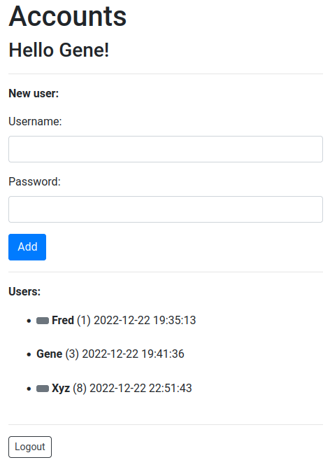

# Mojo-Auth-App

Example of bcrypt authentication with Mojolicious

    git clone https://github.com/ology/Mojo-Auth-App.git
    cd Mojo-Auth-App
    cpanm --installdeps .
    perl script/create-db
    morbo script/auth_eg
    open http://127.0.0.1:3000/
    # then login as fred / flintstone

